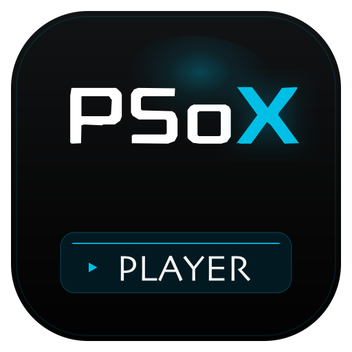

<p align="center">
  
</p>

<h1 align="center">PSoXide</h1>

<p align="center">
  <strong>A Rust-native PlayStation 1 development platform — full-stack rewrite, third attempt.</strong>
</p>

<p align="center">
  
</p>

PSoXide aims at an emulator + SDK + engine co-designed around the same hardware model, so asset formats, BIOS call shapes, and GPU command layouts stay coherent across the stack. The ultimate goal is an engine tuned tightly enough to push the PS1 to its limits — down to the kind of work FromSoftware did on their own PS1 RPGs (King's Field, Shadow Tower).

This is attempt number three. It starts honest: a CPU interpreter whose every instruction is validated bit-identically against PCSX-Redux, peripherals grown one typed subsystem at a time, and a frontend designed for debugging from day one.

## Status

Milestones A–D cleared; commercial games boot and play. The emulator now runs Crash Bandicoot, Tekken 3, and the other disc-based canaries end-to-end with audio, gamepad input, and full-colour FMV display.

### What works today

- **CPU** — every R3000A opcode the BIOS + game code paths need, validated bit-identically against PCSX-Redux for the first 10M instructions (`make parity`). Delay-slot-aware EPC, SYSCALL / BREAK, arithmetic overflow exceptions, the "interrupts vs GTE cofun" hardware-bug workaround.
- **GTE** — all opcodes (RTPS/RTPT, NCS/NCT, NCDS/NCDT, NCCS/NCCT, CC, CDP, MVMVA, GPF/GPL, INTPL, NCLIP, OP, SQR, AVSZ3/AVSZ4, DPCS/DPCT). Hardware-accurate UNR divide. Stage-1 BK-bias fix for the NC* family.
- **GPU** — full primitive set: monochrome / Gouraud / textured / textured-shaded triangles + quads, mono + Gouraud lines (single + polyline), fill rects, VRAM transfers, tpage + CLUT + semi-transparency, mask-bit protection, texture window, 4×4 Bayer dithering, 24-bit display mode, sprite X/Y flip. Wireframe debug toggle in the toolbar. GPUSTAT busy-flag pacing.
- **SPU** — 24 voices with real ADPCM decoder, Neill-Corlett ADSR envelopes, 4-point Gaussian interpolation (1024-entry table), per-register volume-sweep envelopes, noise generator (LFSR), stereo output at 44.1 kHz, CD audio mix, SPU IRQ on address-match, DMA4.
- **MDEC** — full decoder (RLE + AAN IDCT + YUV→RGB in 15 / 24-bit), quantization-table upload, DMA0/DMA1 plumbing.
- **CDROM** — disc insertion, ReadN/ReadS, Init/Pause/Stop, SetLoc, SetMode with single-speed / double-speed pacing, GetStat / GetID / GetlocL / GetlocP, Test 0x20, CdlPlay, XA ADPCM streaming audio (4-bit stereo 37.8 kHz).
- **Controllers** — DualShock (digital + analog + rumble) on both ports. Host gamepad via `gilrs` (Xbox / PS-layout both mapped), keyboard fallback, memory cards.
- **Frontend** — winit + wgpu + egui desktop app with Menu menu, audio output via cpal, live register / VRAM / memory panels with breakpoints, continuous-run mode, HUD metrics (FPS / MIPS / dt / audio-queue), debug-toggle toolbar cluster.
- **Timers** — three root counters with HBlank / VBlank / dot-clock sync modes, PAL + NTSC timing (`Bus::set_pal_mode`).
- **Parity harness** — headless PCSX-Redux oracle with cached traces. `make parity` steps both emulators lockstep and asserts bit-identical `InstructionRecord`s.

### What's still deferred

- **SPU reverb mix** — register bank is live (round-trip correct) but the IIR pipeline is not wired. Sound is dry, not muffled.
- **20M-step parity divergence** — pre-existing DMA-completion timing drift around the BIOS SPU-init window. Three diagnostic probes in `examples/probe_*.rs` ready for a focused session.
- **Niche peripherals** — SIO1 link cable, multi-tap, Guncon, mouse, neGcon, PocketStation.
- **CD-DA (Red Book) playback** — protocol accepted, but the ISO loader doesn't expose per-track audio data yet, so music tracks play silently.

## Repository Layout

```text
.
├── crates/                 no_std target-agnostic shared crates
│   ├── psx-hw              memory map, register addresses, HW constants
│   ├── psx-iso             BIN/CUE + ISO9660 + BCD/MSF helpers
│   └── psx-trace           per-instruction trace record format (emu + oracle emit it)
│
├── emu/                    host workspace (emulator + frontend + parity oracle)
│   ├── crates/
│   │   ├── emulator-core   CPU + Bus + GTE + GPU + SPU + MDEC + CDROM + SIO + IRQ + Timers + DMA
│   │   ├── frontend        winit + wgpu + egui + cpal + gilrs desktop app
│   │   └── parity-oracle   headless PCSX-Redux harness for trace comparison
│   └── Cargo.toml          host-side workspace, stable toolchain
│
├── sdk/                    PS1-targeted workspace (empty until Milestone C)
├── tests/                  top-level integration tests (parity goldens, etc.)
├── docs/                   design notes, hardware refs
├── assets/                 branding, static resources
└── Makefile                common entry points
```

## Workspaces

| Workspace | Path | What it contains | Target |
|-----------|------|------------------|--------|
| Root | `/` | shared `no_std` crates (`psx-hw`, `psx-iso`, `psx-trace`) | any |
| Emulator | `emu/` | `emulator-core`, `frontend`, `parity-oracle` | host |
| SDK | `sdk/` | (empty — lands with Milestone C) | `mipsel-sony-psx` |

Splitting into separate workspaces lets the SDK target `mipsel-sony-psx` with `build-std` on nightly without polluting the host workspace's toolchain.

## Development

### Requirements

- Rust stable (for `emu/` and root)
- A PS1 BIOS image configured in `settings.ron` or via `PSOXIDE_BIOS`
- [PCSX-Redux](https://github.com/grumpycoders/pcsx-redux) built from source for parity testing (with patched-in `stepIn` / `runExecute` / `setQuietPauseResume` Lua bindings)

### Common commands

```bash
make check        # cargo check across both workspaces
make test         # fast unit tests (both workspaces, excludes canaries)
make canaries     # commercial-game canary tests (Milestones D–K)
make fmt          # format both workspaces
make lint         # clippy -D warnings
make run          # launch the desktop frontend
make parity       # step emulator + Redux and assert bit-identical traces
```

### Keyboard + gamepad bindings

Defaults in the frontend:

| Input | Arrow keys | Z | X | A | S | Enter | Shift | Q / W | E / R |
|---|---|---|---|---|---|---|---|---|---|
| PSX | D-pad | Cross | Circle | Square | Triangle | Start | Select | L1 / R1 | L2 / R2 |

Host gamepad (if `gilrs` detects one): Xbox-layout face buttons map to DualShock positions (A → Cross, B → Circle, X → Square, Y → Triangle); left stick drives the analog L-stick and doubles as a D-pad proxy; right stick drives the R-stick; triggers map to L2 / R2.

### Debug toolbar

The top-of-window toolbar shows live metrics (FPS / MIPS / frame time / audio-queue depth) alongside toggle icons for the debug panels:

- **CPU** — registers + exec history + breakpoints
- **TERMINAL** — memory viewer with hex + disassembly
- **LAYERS** — full VRAM overview
- **MONITOR** — frame profiler with host timings, PS1 cycle-budget load, GTE counters, GPU command counts, and 60/30 fps budget lines
- **GRID** — wireframe mode (triangles render as edges only)

Each button tints green when its target is active.

For log-based profiling, launch the frontend with `PSOXIDE_PROFILE=1` for
one-line rolling summaries, or `PSOXIDE_PROFILE=trace` for every frame.
The toolbar/profiler separate host wall-clock timing from guest PS1 work:
`EMU`/`emu_hz` is emulated VBlank cadence, `DRAW`/`draw_hz` is the cadence of
VBlanks that actually produced draw packets, and `HOST`/`host_fps` is desktop
redraw cadence. `cyc_f`/`budget_f` show cycles per emulated frame, and
`gte_f`/`gtecy_f` show GTE command load.

### Canary milestone ladder

Validation is organized around named-game canaries rather than "support all games." Each milestone locks in a specific capability, then becomes a regression test.

| # | Milestone | Canary | Status |
|---|---|---|---|
| A | BIOS boots to Sony logo | SCPH1001 | ✅ |
| B | BIOS boots to shell (no disc) | SCPH1001 | ✅ |
| C | Homebrew SDK triangle renders | your SDK | pending SDK |
| D | BIOS disc-check passes + licensed-disc screen | Crash Bandicoot, Tekken 3 | ✅ |
| E | Title screen renders | Crash Bandicoot | in progress |
| F | Intro FMV plays | Crash Bandicoot | MDEC ready, wiring in progress |
| G | Complex MDEC cutscenes | Metal Gear Solid | |
| H | Multi-track audio CD | Resident Evil 2 | CD-DA protocol accepted |
| I | 60 fps timing-critical | Tekken 3 | |
| J | PAL region + timing | WipEout 2097 | `Bus::set_pal_mode` ready |
| K | Stretch: heaviest GTE | Gran Turismo 2 | |

## Design principles

- **Parity first on the CPU**, then pivot to subsystem-capability on peripherals. Bit-identical traces against a real emulator catch bugs cheaply at the instruction level; peripherals are too stateful for that to scale.
- **Debug instrumentation is compile-time gated.** Cargo features, not runtime flags. Release binaries have zero debug paths — direct lesson from psoxide's perf-degrading trace accumulators.
- **No UI in the core.** `emulator-core` outputs state; the frontend is a separate consumer. Makes VRAM regression debuggable as "was the state wrong, or was the rendering wrong?"
- **Commercial-game compatibility is validation, not a goal.** If Crash boots, the engine can target real hardware with confidence. If it doesn't, there's an accuracy gap the engine would inherit silently.

## Prior art

PSoXide is the third attempt; the first two taught the architectural lessons and are kept as private archives:

- **[PSoXide-v1](../psoxide-v1)**: unified platform monorepo (SDK + emulator + editor + integration). Mature CPU, full SDK, working frontend. Stalled on the exponential-tail work of commercial-game parity. Its Menu menu, HUD bar, and gamepad module live on here.
- **[PSoXide-v2](../psoxide-v2)**: first focused-emulator attempt — got to boot + flat triangles but never reached full stack. Its Redux-oracle harness and debug-panel layout are the direct ancestors of the current tooling.

## License

GPL-2.0-or-later
