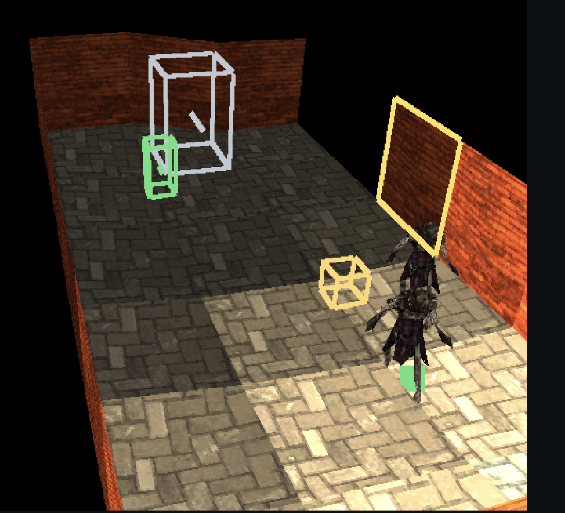
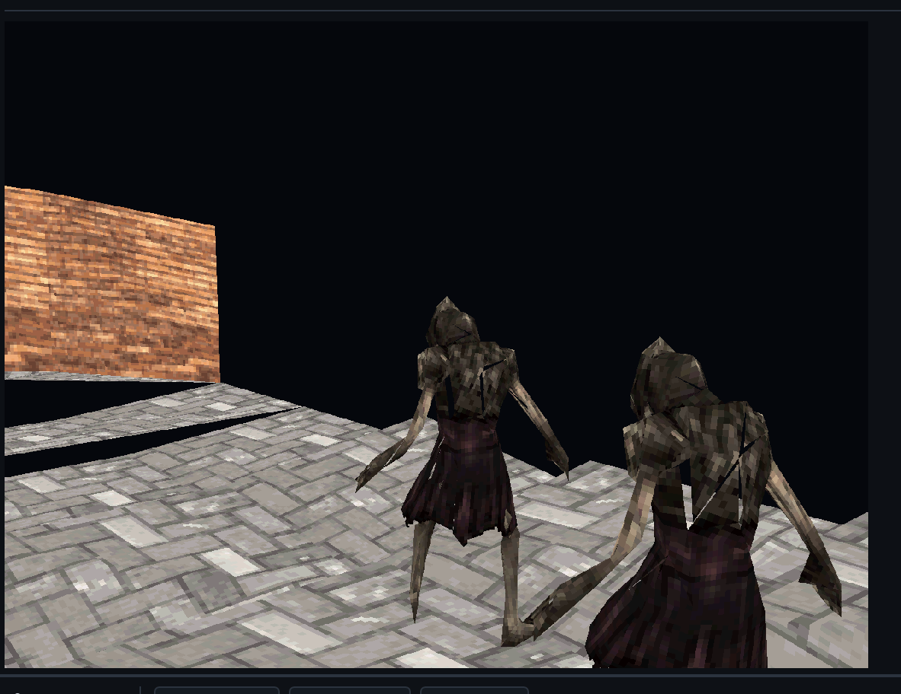

# PSoXide

<p align="center">
  
</p>

<p align="center">
  <a href="LICENSE"></a>
  
  
</p>

PSoXide is a Rust-native PlayStation 1 platform. It is deliberately
all three pieces in one repository:

- a PS1 emulator and debugger frontend,
- a PS1 homebrew SDK and runtime engine,
- an editor plus a playable PSX game prototype.

The through-line is consistency: the editor cooks the same asset
formats that the runtime reads, the runtime runs inside the same
emulator frontend used for debugging, and the emulator is tested
against real BIOS and disc behavior.

This is research-grade software. It is useful, hackable, and moving
fast, but it is not a polished emulator release, not a stable public
SDK, and not a finished game editor yet.

## Media

Current editor build, captured from the bundled default project:

| Editor 3D View | Embedded Play Mode |
| --- | --- |
|  |  |

A short editor/play-mode walkthrough video is still on the release
checklist.

## Current Status

What works today:

- Emulator core for the major PS1 CPU, GTE, GPU, DMA, CD-ROM, SIO pad,
  timers, MDEC, and SPU paths needed by the current canaries.
- Desktop frontend built with winit, wgpu, egui, cpal, and gilrs.
- Debugger-style panels for registers, memory, VRAM, execution history,
  profiler data, and game/example launching.
- BIOS boot canaries for logo/shell paths and commercial-disc boot
  canaries used as ignored regression tests.
- MIPS Rust SDK examples targeting `mipsel-sony-psx`.
- Runtime engine examples for sprites, text, 3D meshes, lighting, fog,
  particles, rooms, and small games.
- `psxed` content pipeline for cooked texture, mesh, model, animation,
  and room/world artifacts.
- Editor project model with scene tree, resources, inspectors, 2D/3D
  viewports, room-grid authoring, materials, lights, model placement,
  and a playable character resource.
- Embedded editor Play mode: the editor cooks the active project, builds
  the internal `editor-playtest` PSX EXE, side-loads it into the current
  frontend, and displays the live game framebuffer inside the editor's
  3D viewport.

What is not done:

- General commercial-game compatibility is incomplete. Timing drift and
  long-tail peripheral behavior are still active emulator research.
- CD-DA, SPU reverb, more peripherals, memory cards, and edge-case GPU
  behavior need more completeness work.
- The editor is a prototype. It has real project/cook/play flow, but
  needs project templates, import UX, richer validation, undo depth,
  packaging, and more stable authoring ergonomics.
- The SDK and engine APIs are not semver-stable.
- Public release legal cleanup is not finished. See
  [docs/license-audit.md](docs/license-audit.md).
- No release binaries are published. Build from source.

## First Clone Path

### 1. Install dependencies

Verified path on macOS:

```bash
xcode-select --install
curl --proto '=https' --tlsv1.2 -sSf https://sh.rustup.rs | sh
```

Then open a new shell. The repo's `rust-toolchain.toml` pins nightly and
asks rustup for `rustfmt`, `clippy`, `rust-src`, and `llvm-tools`.

On Debian/Ubuntu-style Linux hosts, install the native packages the
frontend stack usually needs:

```bash
sudo apt install build-essential pkg-config libasound2-dev libudev-dev \
  libx11-dev libxi-dev libxrandr-dev libxinerama-dev libxcursor-dev \
  libxkbcommon-dev libwayland-dev mesa-vulkan-drivers
```

Windows is not documented as a first-class path yet.

### 2. Clone and check the repo

```bash
git clone https://github.com/EBonura/PSoXide.git psoxide
cd psoxide
make check
make test
```

The fast defaults do not require commercial games or PCSX-Redux.
Canaries and parity tests are ignored by default.

### 3. Configure a BIOS

PSoXide does not include a PlayStation BIOS and will not download one
for you. Dump your own BIOS image, then either export it:

```bash
export PSOXIDE_BIOS=/absolute/path/to/SCPH1001.BIN
```

or set `paths.bios` in the frontend's `settings.ron`.

The GUI can open without a BIOS for UI work, but launching discs and
embedded editor Play currently require a configured BIOS path. Embedded
Play side-loads the generated EXE through HLE BIOS after the bus is
created.

### 4. Launch the frontend

```bash
make run
```

Useful options:

```bash
cd emu
cargo run -p frontend --release -- --windowed
cargo run -p frontend -- info
cargo run -p frontend -- scan --root /path/to/games
cargo run -p frontend -- list
```

### 5. Open the editor

Launch the frontend, then use the Menu Create column to open the editor
workspace. The default project lives at:

```text
editor/projects/default/project.ron
```

Editor Play workflow:

1. Open the editor workspace.
2. Edit the scene/resources.
3. Click Play in the editor controls.
4. The frontend saves the project, cooks generated assets into
   `engine/examples/editor-playtest/generated/`, runs
   `make build-editor-playtest`, and side-loads
   `build/examples/mipsel-sony-psx/release/editor-playtest.exe`.
5. The editor 3D viewport switches from editable preview to the live PSX
   framebuffer.
6. Click the viewport to capture input for the game.
7. Press Escape or Select+Start to release capture; press Stop to return
   to the editable preview.

Default keyboard pad bindings:

| PSX Control | Keyboard |
| --- | --- |
| D-pad | Arrow keys |
| Cross | X |
| Circle | C |
| Square | Z |
| Triangle | S |
| L1 / R1 | Q / E |
| L2 / R2 | 1 / 3 |
| Start / Select | Enter / Backspace |
| Analog toggle | F9 |

For the editor-playtest third-person movement work, a gamepad is the
best current input path. Circle is run.

## Build Targets

Quality gates:

```bash
make check      # cargo check across root/editor/emu/engine/sdk/tools
make test       # fast non-ignored tests
make fmt        # rustfmt across every workspace/tool
make lint       # clippy -D warnings across every workspace/tool
make canaries   # ignored BIOS/commercial-game canaries
```

SDK and engine examples:

```bash
make examples
make hello-tri
make showcase-model
make game-pong
make run-tri
make run-showcase-model
```

Editor/playtest internals:

```bash
make cook-playtest          # cook starter or PROJECT=/path/project.ron
make build-editor-playtest  # build whatever is currently generated
```

`make cook-playtest` is destructive for
`engine/examples/editor-playtest/generated/`; the editor Play action
normally owns that directory.

## Examples

The repo ships 18 runnable examples that double as the de-facto test
suite for the SDK and engine. Each builds for `mipsel-sony-psx` and
runs end-to-end through the emulator frontend (`make <name>` to build,
`make run-<name>` where supported).

### SDK examples — bare-metal MIPS, no engine framework

| Example | What it demonstrates |
| --- | --- |
| `hello-tri` | Smallest interesting homebrew. GPU init, framebuffer clear, one Gouraud triangle per frame with a time-based wobble. Proves the EXE loader, render loop, and basic GPU primitives. |
| `hello-tex` | 4bpp CLUT texture upload + animated bouncing sprites. Exercises the full texture pipeline: editor cooker (`psxed tex`) → cooked `.psxt` blobs → VRAM upload → sprite render. |
| `hello-input` | Polls the port-1 pad every frame and renders feedback that reacts to held buttons. Proves SIO0 + pad and ASCII text rendering through `psx-font`. |
| `hello-audio` | Four face buttons trigger four SPU voices with different built-in waveforms and pitches. Smallest end-to-end SPU demo. |
| `hello-ot` | Three overlapping Gouraud triangles depth-sorted via an ordering table and DMA channel 2 in linked-list mode — the same path commercial games use. |
| `hello-gte` | 3D cube spinning via the GTE: rotation matrix, vertex projection, edge drawing. The smallest GTE-based 3D demo. |

### Engine examples — built on the `psx-engine` Scene/App framework

**Starter**

| Example | What it demonstrates |
| --- | --- |
| `hello-engine` | Smallest engine demo. Single bouncing Gouraud square driven by a sine wave on `Angle`. Proves the `Scene` / `App::run` plumbing. |

**Showcases**

| Example | What it demonstrates |
| --- | --- |
| `showcase-3d` | Flagship 3D demo. Suzanne (decimated to ~180 tris) and Utah teapot rendered with GTE NCCS hardware lighting under three directional lights. |
| `showcase-fog` | Full PS1-commercial GTE + textured-poly pipeline: per-vertex RTPS projection, NCLIP back-face cull, AVSZ3 ordering-table insertion, and depth-cue fog. |
| `showcase-lights` | Four coloured moving point lights illuminating scaled cubes. Complementary to `showcase-3d` — point-light path vs. directional. |
| `showcase-model` | Animated-model demo. Two characters sharing a 24-joint biped rig; D-pad orbits the camera, Square/Circle steps through animation clips, Select swaps character. |
| `showcase-particles` | Fixed-pool particle effects through the engine's ordering-table helpers. Routes `psx-fx` simulations through the same render path as the GTE-heavy showcases. |
| `showcase-room` | Renders a cooked `.psxw` room on PS1 hardware. End-to-end validation of cooker → asset → runtime: `build.rs` cooks the editor's starter room, the binary parses it through `RuntimeRoom`, and `draw_room` walks every sector. |
| `showcase-text` | Tour of every text-rendering capability of the `psx-font` crate: 8×8 and 8×16 IBM VGA fonts, gradient title, multi-font comparison, palette tricks. |
| `showcase-textured-sprite` | Compact interactive material room. Dark brick walls + cobblestone floor with a central pane cycling through textured materials. |

**Mini-games**

| Example | What it demonstrates |
| --- | --- |
| `game-pong` | Two-paddle Pong, first full game ported to the engine framework. Left = D-pad, right = AI with hysteresis band, first to 7 wins. |
| `game-breakout` | Brick-buster. 40-brick rainbow wall, gradient background, particle bursts on break, ball trail, screen shake. |
| `game-invaders` | Space Invaders. 5×10 marching alien grid that speeds up as the formation thins, player bullet + up to 4 enemy bombs, wave progression. |

## Repository Layout

```text
.
├── crates/                 shared no_std-compatible PSX primitives
├── docs/                   architecture notes, hardware references, audits
├── editor/                 editor UI, project model, cook pipeline, psxed CLI
├── emu/                    emulator core, frontend, settings, parity oracle
├── engine/                 PSX runtime engine crates and examples
├── sdk/                    PSX SDK crates and bare-metal examples
├── tools/                  standalone utilities
├── assets/                 branding and shared cooked demo assets
└── Makefile                top-level quality and example commands
```

Generated contract:

- `engine/examples/editor-playtest/generated/level_manifest.rs` is a
  tracked placeholder so the runtime template builds from a clean tree.
- Cooked generated rooms, textures, models, and built EXEs are ignored
  and regenerated by editor Play or `make cook-playtest`.
- `/build/` is an output directory, not source.

## External Files

Not included:

- PlayStation BIOS images.
- Commercial game disc images.
- PCSX-Redux binaries or source trees.
- Large original texture/model sources beyond the small committed demo
  inputs described in the license audit.

Ignored tests and parity tools may require:

- `PSOXIDE_BIOS=/path/to/bios.bin`
- a local PCSX-Redux build,
- local game images you legally own.

## License

PSoXide is licensed under the **GNU General Public License, version 2
or (at your option) any later version**. The full license text is in
[LICENSE](LICENSE); third-party references and provenance are in
[NOTICE.md](NOTICE.md).

The GPL choice is deliberate: the emulator core builds on PCSX-Redux
as a parity oracle and reference, and PCSX-Redux is GPL-2.0-or-later.
Releasing PSoXide under the same license keeps the lineage clean.

Outstanding non-license release items (asset provenance, BIOS-output
goldens, README media) are tracked in
[docs/license-audit.md](docs/license-audit.md).
